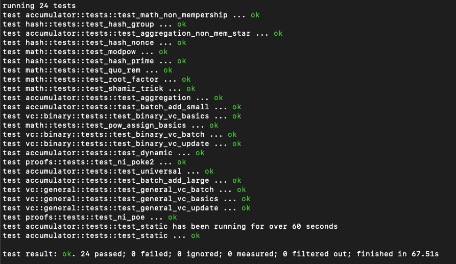

# Accumulators and Vector Commitments

[![crates.io version][crate-shield]][crate] [![CircleCI][circleci-shield]][circleci] [![Docs][docs-shield]][docs] [![License][license-shield]][license]

> Implementations based on [Batching Techniques for Accumulators with Applications to IOPs and Stateless Blockchains](https://eprint.iacr.org/2018/1188).

Extra Readings:

    - https://kodu.ut.ee/~lipmaa/papers/lip12b/cl-accum.pdf
    - https://www.cs.purdue.edu/homes/ninghui/papers/accumulator_acns07.pdf
    - https://github.com/Chia-Network/vdf-competition/blob/master/classgroups.pdf
    - https://eprint.iacr.org/2018/623.pdf

## Usage for Classgroups
We utilize a third party BigNum Lib for now. Pure rust implementation soon.

- Install the [GNU Multiple Precision Library](https://gmplib.org/)
    * On Debian and derivatives (including Ubuntu):
        ```sh
        $ sudo apt-get install -y libgmp-dev
        ```
    * On Red Hat and derivatives (Fedora, CentOS)
        ```sh
        $ sudo dnf -y install gmp-devel
        ```
    * Using Homebrew
        ```sh
        $ brew install gmp
        ```
    

## Install Rust   
- Use rustup to install rustc and cargo.  
- The project is built with rustc 1.65.0-nightly (2022-08-21):
    ```sh
    $ rustup default nightly
    ```
    Following this link to manage rust versions:https://doc.bccnsoft.com/docs/rust-1.36.0-docs-html/edition-guide/rust-2018/rustup-for-managing-rust-versions.html
- Get test results:
    ```sh
    $ cd src
    $ cargo test
    ```
    

## TODO
- A full-fledged member set.

## LICENSE

MIT or Apache 2.0

## Contribution

Unless you explicitly state otherwise, any contribution intentionally submitted
for inclusion in rust-accumulators by you, as defined in the Apache-2.0 license, shall be
dual licensed as above, without any additional terms or conditions.

[circleci-shield]: https://img.shields.io/circleci/project/github/dignifiedquire/rust-accumulators.svg?style=flat-square
[circleci]: https://circleci.com/gh/dignifiedquire/rust-accumulators
[docs-shield]: https://img.shields.io/badge/docs-online-blue.svg?style=flat-square
[docs]: https://docs.rs/crate/accumulators/
[license-shield]: https://img.shields.io/badge/License-MIT%2FApache2.0-green.svg?style=flat-square
[license]: https://github.com/dignifiedquire/rust-accumulators/blob/master/LICENSE.md
[crate-shield]: https://img.shields.io/crates/v/accumulators.svg?style=flat-square
[crate]: https://crates.io/crates/accumulators
